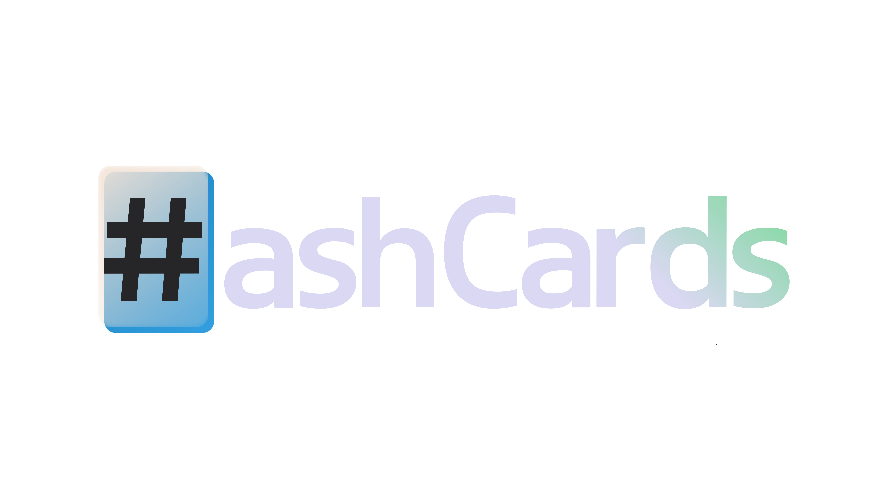

# Flashcards, sans flashy.

## Table of Contents
- [About](#about)
- [Features](#features)
- [FAQ](#faqs)
- [Support and Feedback](#support-and-feedback)
- [Contributing](#contributing)
- [Tech stack](#tech-stack)
- [Self-hosting](#self-hosting)

## About
HashCards is an online flashcard platform without the ads, paywalls, or outdated user interface. It was created to address some of the major issues with online flashcard services today.

## Features
- Create and share sets
- Add images to cards
- Autosave
- Import from other platforms
- Study mode
- Intuitive math typing (like Desmos)
- Search & Explore
- OAuth and traditional verified-email login options
- Account management & privacy features
- Export sets
- Pin sets
- Recent sets
- User experience and leveling system

## FAQs
#### Why use HashCards when I can just keep using other platforms?
A: HashCards strives to be the best platform for creating flash cards and studying them by providing a clean, user-friendly, and minimalistic (yet full-featured) interface. It is also the best platform for math flashcards due to its unique math equation capabilities. We don't trick our users by paywalling or limiting existing features. We believe in the potential of open development. Using HashCards should be frictionless and non-distracting. If it's not, make sure to [let me know](#support-and-feedback)!

#### How can I make a HashCards set?
A: It's easy! Just [sign up for an account here](https://hashcards.net/register), then clcik "New". From there, the editor is quite user-friendly and will automatically save your work as you go.

#### What about my data? Can I import and export?
A: HashCards supports [importing sets from other sites such as Quizlet](https://hashcards.net/learn/import). You can also export HashCards sets individually, and request a copy of all of your data.

#### Can I use HashCards' code or parts of it for my own purposes?
Currently, HashCards is not licensed. Therefore, the code falls under "All rights reserved", meaning that you cannot make copies/distribute it. However, I plan to add a license in the future. The reason there is no license yet is because I do not want another entity to be able to commercialize HashCards, and I have not found a license that aligns with this yet.

## Support and Feedback
If you would like to make a feature request or need help, create an issue here on GitHub or shoot me an email at dev@jvadair.com.

## Contributing
Contributions to HashCards are currently closed. If you would like to contribute to HashCards, please [contact me](#support-and-feedback) or wait until contributions are enabled.

## Tech stack
Here's a list of the technology/libraries HashCards uses. Please let me know if it neglects to mention a library used in the project.
1. [pyntree](https://github.com/jvadair/pyntree)
2. [registrationAPI](https://github.com/jvadair/registrationAPI)
3. [Flask](https://github.com/pallets/flask)
4. [Flask-SocketIO](https://github.com/miguelgrinberg/flask-socketio)
5. [SocketIO](https://github.com/socketio/socket.io)
6. [jQuery](https://github.com/jquery/jquery)
7. [Authlib](https://github.com/lepture/authlib)
8. [APScheduler](https://github.com/agronholm/apscheduler)
9. [TheFuzz](https://github.com/seatgeek/thefuzz)
10. [cryptography](https://github.com/pyca/cryptography/)
11. [flask-sitemapper](https://github.com/h-janes/flask-sitemapper)
12. [pathvalidate](https://github.com/thombashi/pathvalidate)
13. [MathQuill](https://github.com/mathquill/mathquill)
14. [QRCode.js](https://github.com/davidshimjs/qrcodejs)
15. [short_url](https://github.com/Alir3z4/python-short_url/)

## Self-hosting
HashCards was not designed to be self-hosted. If you are looking to self-host a copy of HashCards, please feel free to [reach out to me](#support-and-feedback).

---

&copy; James Adair 2023. All rights reserved.

